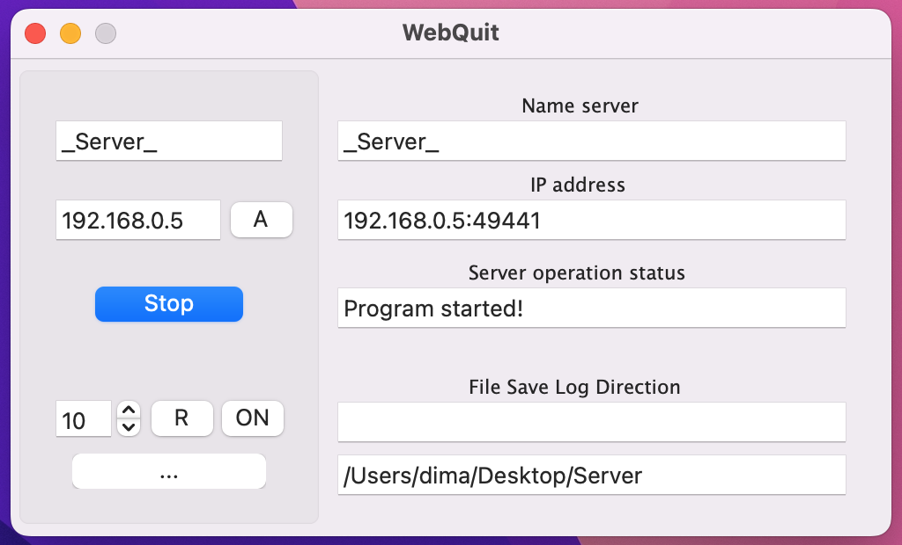

# WebQuit-Program

WebQuit is a program for Web storage access, or access to your site.

The project is being developed, for commercial purposes, to make it possible to launch home storage on the local network, the project continued to develop further, the program's capabilities increased, it became possible to launch your site both on the local network and on the global one.

By functionality:
- The program is able to process dozens of requests, it is limited only by the power of the computer, as well as by the low speed of the Internet.
- It is possible to display notifications.
- Turn on the Status Tray.
- Enable access to the storage or site by password.
- There is a built-in WebView to quickly view the status of the server.
- Output of log information.
- For a local network, the program automatically selects an IP.
- Convenient and simple functionality.

---

Main window:

